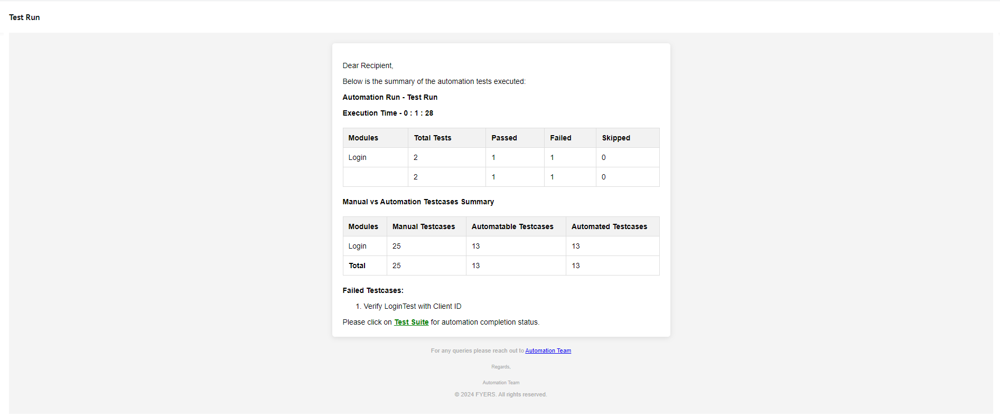

# Mobile Automation Framework

This is a robust and scalable mobile automation framework designed to streamline testing for Android and iOS
applications. The framework integrates with tools like Appium, BrowserStack, and RestAssured for end-to-end test
coverage.

## Features

- **Cross-Platform Support:** Test both Android and iOS
  apps.
- **Data-Driven Testing:** Uses JSON files for test data
  management.
- **Cloud Integration:** BrowserStack has been integrated for cloud-based
  execution.
- **Platform independent locators:** YAML-based locator strategy for
  flexibility.
- **Failure Handling:** Captures screenshots for test
  failures.
- **Thread-Safe Execution:** ThreadLocal instances for driver and session
  management.
- **Java Support** - Supports latest version of Java

## Prerequisites

- Java (Latest version available)
- Maven
- BrowserStack account
- Android Studio # Required for offline run and inspect elements
- Appium Server # Required for offline run and inspect elements
- Appium Inspector # Required for offline run and inspect elements

## Instructions

### Mobile App Configuration - Browserstack

- Goto browserstack.com
- Navigate to App automate
- Upload Mobile app
- Copy the app id which starts from bs://
- Copy username and access key from browserstack
- Paste it in **browserstack.yml** file in root folder
- Define the platforms
  using [Browserstack Capability Builder](https://www.browserstack.com/docs/app-automate/capabilities)

```yaml

browserstack:
  userName: "YOUR_USERNAME"
  accessKey: "YOUR_ACCESS_KEY"
  appId: "bs://<your-app-id>"
  platforms:
    - Mobile(Android/iOS)
    - version
```

### Project Tree

```
src
├── main
│ ├── java
│ │ ├── org
│ │ │ ├── roopesh 
│ │ │ │ ├── actions 
│ │ │ │ ├── appium 
│ │ │ │ ├── config 
│ │ │ │ ├── constants 
│ │ │ │ ├── customExceptions 
│ │ │ │ ├── helpers 
│ │ │ │ ├── pages 
│ │ │ │ ├── pageTestData 
│ │ ├── utilities 
│ │ │ ├── annotations 
│ │ │ ├── dataUtility 
│ │ │ ├── emailConfig 
│ │ │ ├── otp 
│ │ │ ├── reports 
│ │ │ ├── retryUtility 
│ │ ├── config 
│ ├── resources
│ │ ├── config
│ │ │ ├── config.properties
│ │ ├── htmlContent
│ │ │ ├── mailReport.vm
├── test
│ ├── java
│ │ ├── org
│ │ │ ├── roopesh 
│ │ │ │ ├── tests 
│ │ │ │ │ ├── regression 
│ │ ├── data 
│ │ ├── listeners 
│ ├── resources
│ │ ├── locators # YAML files for element locators
│ │ ├── testData # JSON files for test data
│ ├── testxmls
```

### Framework walkthrough

[BaseTest](src/test/java/org/roopesh/BaseTest.java) class is the foundational class for the test scripts that are being
developed.
[Config](src/main/resources/config/config.properties) property file holds all the required properties which is required
by the framework.
Update the config file with the email configuration details

```properties
platform=android

isEmailReportingEnabled=true
smtpHost=
smtpPort=465
smtpUserName=
smtpPassword=
fromId=
toList=
ccList=
socketFactoryPort=465
socketFactoryClass=javax.net.ssl.SSLSocketFactory
smtp.socketFactoryFallback=false
pop3.socketFactoryFallback=false
mailStoreProtocol=pop3
transportProtocol=smtp
startTLSEnable=true
smtpAuth=true
debugAuth=true
mail.debug=true
smtp.sslProtocols=TLSv1.2
smtp.connectionTimeout=30000
extentReportPath=
```

To determine the enviroment specify the above property in *config.properties* file. No need to explicitly define in
testng xml files
Define the testng.xml file as below.
The ${platform} parameter will fetch the property from *config.properties* file

```
<?xml version="1.0" encoding="UTF-8"?>
<!DOCTYPE suite SYSTEM "http://testng.org/testng-1.0.dtd">
<suite name="Local Run">
    <parameter name="os" value="${platform}"/>
    <test name="Local Run">
        <classes>
            <class name="org.roopesh.tests.LoginTest"/>
        </classes>
    </test>
</suite>

```

[AutomationRunManager](src/main/java/org/roopesh/appium/AutomationRunManager.java)

### Test-script writing instructions

* To define locators goto [locators](src/test/resources/locators) folder and define a yaml file with the
  **ModuleName.yaml** and then add the locators in the below format:
  </br>  
  *LoginPage.yaml*
  ```yaml
   elements:
      editText:
        android:
          type: xpath
          value: "//android.widget.EditText"
        ios:
          type: xpath
          value: "//android.widget.EditText"
      submitButton:
        android:
          type: accessibilityId
          value: "submit"
        ios:
          type: accessibilityId
          value: "submit"
  ```
  The locator types are defined in [Locators](src/main/java/org/roopesh/helpers/locators/Locators.java) Class.  
  Now for the defined locators, goto [pages](src/main/java/org/roopesh/pages) and create a locator class with the same
  name as defined in the defaultLocator folder **(This is very important)**.  
  Now in the locator class file define the locators as below:  
  </br>
  *LoginPage.java*

```java

public class LoginPage extends BasePage {
    private final By loginText;
    private final By submitButton;

    public LoginPage() {
        Locators locators = LocatorHelper.getLocators(this);
        loginText = locators.get("editText");
        submitButton = locators.get("submitButton");
    }
}
  ```

* Similarly, For Test-Data goto [testData](src/test/resources/testData) folder and define a json file with the
  desired name and define the test data in the below format.  
  </br>
  *LoginData.json*
  ```json
    {
     "testData": {
       "userName": {
         "name": "User 1",
         "mobileNumber": "9876543210"
            }
       }
    }
  ```
  For the defined test data, goto [pageTestData](src/main/java/org/roopesh/pageTestData) folder and create a class
  with same name as the json file created in testData folder **(This is very important)**.  
  </br>
  *LoginData.java*
  ```
  public class LoginData extends BasePage {
    private final String mobileNumber;

    public LoginData() {
        TestData testData = TestDataHelper.getJSONData(this);
        Map<String, String> userData = testData.getTestData().get("userData");
        mobileNumber = userData.get("mobileNumber");
        otp = userData.get("otp");
        pin = userData.get("pin");
        clientID = userData.get("clientID");
    }
  
  }
  ```
* To write the testcase goto [tests](src/test/java/org/roopesh/tests) folder and define the testcases in the following
  way.  
  </br>
  *LoginTest.java*
  ```java
   @MobileTest(moduleName = "Login", manualTestcaseCount = 25, automatableTestcaseCount = 13, automatedCount = 13)
   public class LoginTest extends BaseTest {
  
   @Test(priority = 1, testName = "Verify Mobile Login")
   public void loginTest() {
        Actions actions = getPage(Actions.class);
        LoginPage loginPage = getPage(LoginPage.class);
        LoginData loginData = getPage(LoginData.class);
        actions.sendValues(loginPage.getLoginText(), loginData.getMobileNumber());
        actions.tapOn(loginPage.getSubmitButton());
    } 
   }
  ```
  In the above LoginTest.class the actions are mobile actions which are defined in
  the [Actions](src/main/java/org/roopesh/actions/Actions.java) Class which is a combination of Gestures and
  WaitForElement
    - Testers can have the liberty to define their own actions for the respective Module Locators or for the respective
      testData Classes.
    - [AssertHelpers](src/main/java/org/roopesh/helpers/AssertHelper.java) class can be utilised to define the
      assertions.
    - [ExtentReportController](src/main/java/utilities/reports/ExtentReportController.java) class can be used to log the
      steps to the extent reports.

### Reporting and Email Template

[TestListener](src/main/java/utilities/reports/TestResultListener.java) class
and [Mailer](src/main/java/utilities/emailConfig/Mailer.java) class files holds the information of test config and Email
info.  
The [template](src/main/resources/htmlContent/mailReport.vm) file defines the mail template of the report.  
The mail that get delivered is displayed as below

Extent Reports is configured to provide detailed, visually rich test execution reports. The reports include:

- ✅ Step-by-step execution logs
- ❌ List of failed and skipped tests with reasons
- 📸 Screenshots for failed steps
- 🧪 Test metadata like module name, platform, and test counts

The reports are automatically generated at the end of the test run and can be found in the reports directory and the
same gets attached in email report (configurable
in [ExtentReportController](src/main/java/utilities/reports/ExtentReportController.java)).

Additionally:

**Email Report Integration:**
The report is embedded in an email template and sent to stakeholders after execution.

**Email Template File:**
Located at src/main/resources/htmlContent/mailReport.vm, this Velocity template defines the layout of the email.

**Failed Test Summary in Email:**
The email highlights only failed and skipped test cases for quick triage.

📷 Sample Email Report


The failed and skipped tests will be listed in the mail for better analysis.

### To Execute the tests

```commandline
mvn test -DsuiteXmlFile=src/test/testxmls/localTest.xml

```
